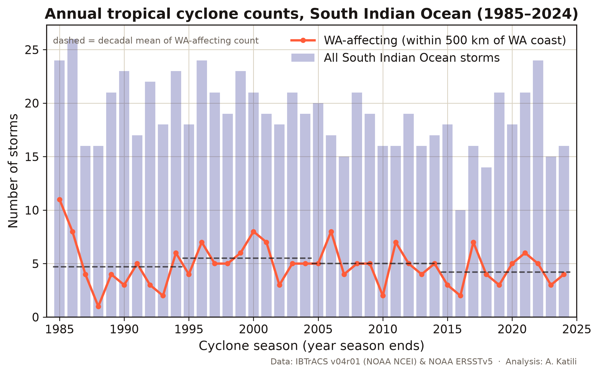
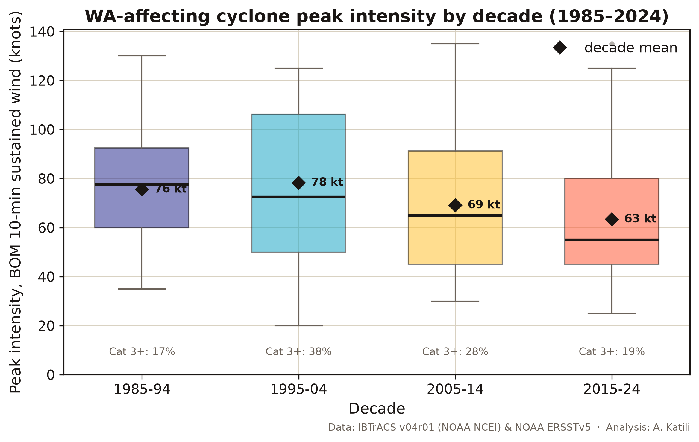
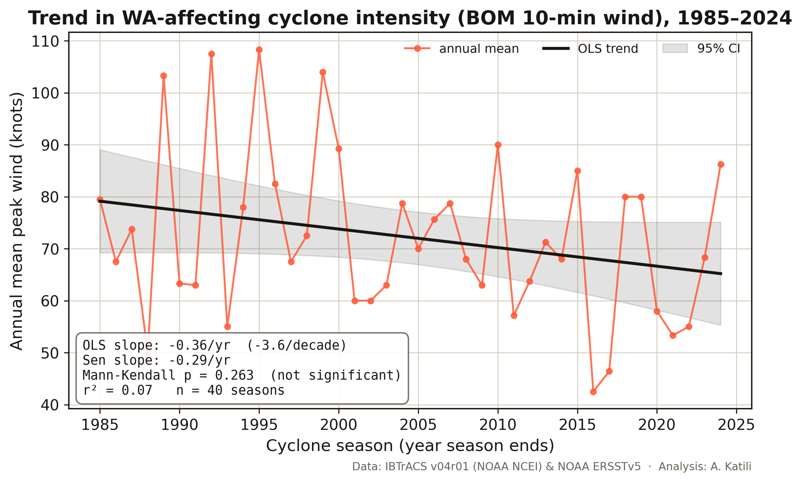
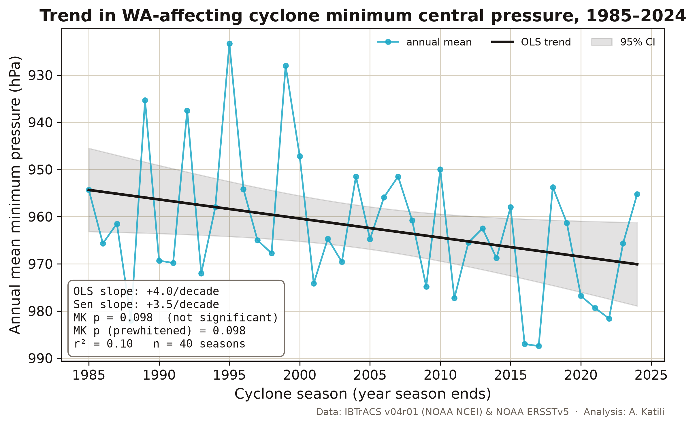
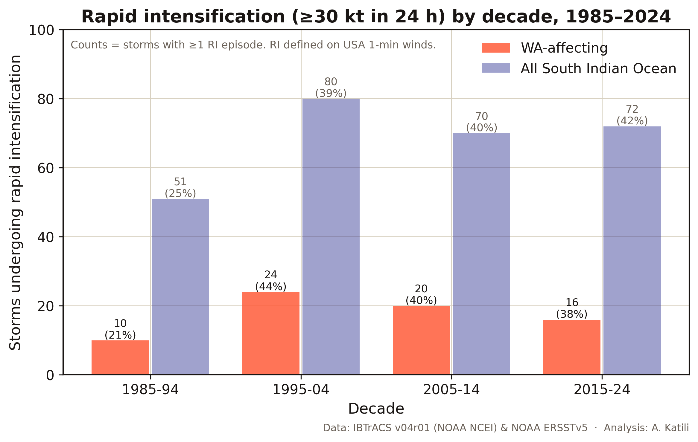
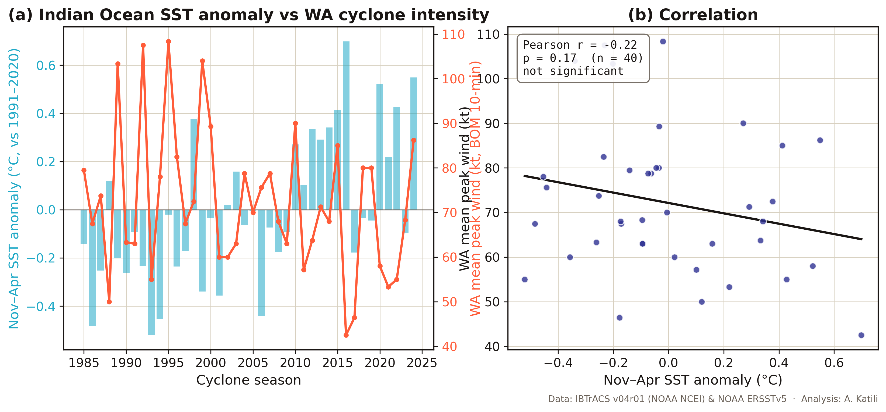

# Physical Climate Risk: Tropical Cyclone Trends Affecting Western Australia (1985–2024)

A data analysis framed for **AASB S2 physical-risk assessment**, Australia's
mandatory climate-disclosure standard.

> **In one paragraph.** Between 1985 and 2024 the seas off Western Australia
> warmed by about 0.5 °C, a robust and statistically significant trend. Yet the
> tropical cyclones that affect WA did **not** get stronger over the same period.
> Their numbers edged down slightly, their average peak intensity drifted lower
> (significant across the whole South Indian Ocean, weaker and not significant for
> the WA-only subset), and there was **no positive correlation** between regional
> sea-surface temperature and cyclone intensity. The practical message for climate
> risk is that you cannot read WA's future cyclone hazard straight off the recent
> local record: warming oceans did not translate into stronger observed storms
> here, so physical-risk assessment has to lean on forward-looking climate
> projections, which is exactly the judgement AASB S2 asks companies to make.

This finding runs against the intuitive "warmer oceans, stronger storms"
headline. That is the point. The value of the analysis is that it tests the
intuition against 40 years of data and reports what the data actually show.

---

## Research question

Has the intensity of tropical cyclones affecting Western Australia changed
between 1985 and 2024, and does it track rising sea-surface temperatures?

"WA-affecting" means a storm whose best-track passed within 500 km of the WA
coast, anywhere from the north Kimberley to the Mid West. The window starts in
1985 because satellite coverage before then makes earlier intensity estimates
unreliable.

## Data

| Source | What it provides | Used for |
|--------|------------------|----------|
| **IBTrACS v04r01** (NOAA NCEI) | Global best-track cyclone positions, winds and pressures | Cyclone counts, intensity, tracks |
| **BOM Tropical Cyclone Database** (IDCKMSTM0S) | Australia's official Southern-Hemisphere track record | Independent cross-check |
| **NOAA ERSSTv5** | Monthly 2° sea-surface temperature, 1854–present | SST trend and correlation |

The analysis covers **758 South Indian Ocean systems**, of which **194 affected
WA**. Intensity is reported as the **BOM 10-minute sustained wind**, the
Australian operational convention, and as **minimum central pressure**.

A note on wind conventions, because it matters for honesty: different agencies
average wind over different periods. The US agencies report a 1-minute sustained
wind; the Bureau of Meteorology reports a 10-minute sustained wind, which is
roughly 12% lower for the same storm. This analysis leads with the BOM 10-minute
value because the subject is WA, and cross-checks it against US winds and against
central pressure (which has no averaging-convention ambiguity).

## How the data were validated

Trust in the cleaning was established before any trend was computed.

The BOM 10-minute winds in IBTrACS match the Bureau's own published database to
the knot for the major WA cyclones (Vance 1999 at 120 kt, Orson 1989 at 130 kt,
Marcus 2018 at 135 kt). The US 1-minute winds sit about 12% higher, exactly as
the averaging-period difference predicts. And 97% of the named WA-affecting
storms flagged by the 500 km rule also appear in the Bureau's Australian-region
database, confirming the geographic filter is sound. Within the WA subset, BOM
wind data are 92% complete (85% in the 1980s, rising to 100% in the most recent
decade), so the headline metric is well-supported for the storms that matter
here, even though it is sparse across the wider basin where other agencies are
responsible.

---

## Key findings

### 1. Frequency: stable to slightly declining

WA sees about 5 cyclones come within 500 km of the coast in an average season.
That number is broadly stable, with a slight downward drift from about 5.1 per
season in 1985–2004 to 4.6 per season in 2005–2024, consistent with the wider
literature on a long-term decline in tropical-cyclone numbers in the Australian
region.



### 2. Intensity: no increase, a weak decline

Average peak intensity of WA-affecting cyclones has drifted **down**, not up,
across the four decades. Mean BOM peak wind fell from about 76 kt in 1985–1994 to
63 kt in 2015–2024, and mean central pressure rose (weakened) from 959 hPa to
973 hPa.

| Decade | WA storms | Mean peak wind (BOM, kt) | Mean min pressure (hPa) | Reached Cat 3+ |
|--------|:---------:|:------------------------:|:-----------------------:|:--------------:|
| 1985–94 | 47 | 76 | 959 | 17% |
| 1995–04 | 55 | 78 | 956 | 38% |
| 2005–14 | 50 | 69 | 964 | 28% |
| 2015–24 | 42 | 63 | 973 | 19% |

*(Cat 3+ uses the Saffir–Simpson category, which is defined on 1-minute winds, so
it is computed from US winds rather than the 10-minute BOM value.)*



Formal trend tests confirm the picture and, importantly, its limits:

| Series | Trend | Significant? |
|--------|-------|--------------|
| WA mean peak wind | −3.6 kt/decade | No (Mann-Kendall p = 0.26) |
| WA mean min pressure | +4.0 hPa/decade (weakening) | Borderline (OLS p = 0.04, Mann-Kendall p = 0.10) |
| Basin-wide mean peak wind | −3.7 kt/decade | **Yes** (Mann-Kendall p = 0.048) |

The direction is consistently toward weaker storms. For the WA-only subset the
trend is real but not statistically robust, because only about five storms a year
is a small sample with a lot of year-to-year noise. Across the whole South Indian
Ocean, where the sample is large, the decline in mean wind is statistically
significant. Two independent metrics, wind and pressure, point the same way,
which strengthens confidence in the direction even where any single test is
marginal.




### 3. Rapid intensification: apparently rising, but read with caution

The share of storms that rapidly intensified (a wind increase of at least 30 kt
in 24 hours, measured on US 1-minute winds) rose from about 21% in 1985–1994 to
around 40% in the later decades. This is the one result pointing toward a more
dangerous future, and it aligns with the physical expectation that warmer oceans
raise the ceiling on intensification.

It comes with a strong caveat. Older best-track records are smoother and less
frequently sampled than modern ones, which mechanically makes rapid
intensification harder to detect in the early years. Part of the apparent
increase is therefore likely an artefact of improving observations rather than a
purely physical change, so the trend should be treated as suggestive, not proven.



### 4. Sea-surface temperature: warming, but decoupled from intensity

The ocean in the WA cyclone development region warmed by **0.16 °C per decade**
(p < 0.0001), about half a degree of warming from the 1980s to today. Despite
that, warmer seasons were **not** associated with stronger WA cyclones. The
correlation between seasonal SST and mean cyclone wind is slightly negative and
not significant (r = −0.22), and the correlation with pressure points the same
way (warmer seasons, marginally weaker storms).



This decoupling is the analytical heart of the project. Sea-surface temperature
sets the energy available to a cyclone, but it is not the only control. Vertical
wind shear, mid-level moisture and the large-scale circulation (including ENSO and
the Indian Ocean Dipole) govern whether that energy is realised. Over the WA
record, those dynamical factors appear to have masked or outweighed the thermal
signal.

---

## What this means for WA industry and AASB S2

Western Australia's coast carries the Pilbara iron-ore and LNG export
infrastructure, offshore oil and gas, coastal towns and agriculture, all of it
exposed to cyclones. Under AASB S2, the listed companies and large financial
institutions behind that infrastructure now have to disclose their material
physical climate risks. Reporting is phased in from 1 January 2025, with the
larger second group, which captures many of the big WA operators, beginning for
periods from 1 July 2026.

This analysis carries one clear and slightly uncomfortable message for that
disclosure work. The recent observed record does not support a simple "cyclones
are getting stronger because the ocean is warming" narrative for WA. An honest
physical-risk assessment cannot lean on the historical trend to claim a rising
hazard, because the historical trend does not show one. What it can and should do
is recognise that the absence of an observed trend is not evidence of safety: the
ocean has warmed substantially, the energy ceiling for the strongest storms has
risen, rapid intensification may be becoming more common, and forward-looking
climate models still project a shift toward fewer but potentially more intense
systems. Sound disclosure therefore rests on scenario-based projections rather
than extrapolation of the past, which is precisely the discipline AASB S2 is
designed to enforce.

The timeliness is hard to miss. The 2025–26 season produced Severe Tropical
Cyclone Narelle, a Category 5 system that struck the Kimberley and Gascoyne in
March 2026 with damage estimated near half a billion dollars. A quiet long-term
trend and a devastating individual season are not a contradiction. They are the
reason risk has to be assessed on the tail of the distribution, not the average.

---

## Limitations

The honest caveats, stated plainly. The WA-affecting subset is small, about five
storms a year, so WA-only trends have limited statistical power and the
not-significant results should be read as "no clear signal" rather than "no
change." Intensity estimates rest on best-track data whose quality and sampling
improved over the period, which can bias trends, most acutely for rapid
intensification. The SST analysis uses a single regional box and a seasonal
average, so it captures the broad thermal signal but not finer-scale ocean
structure. And 40 years is short for climate trend detection; these results
describe the satellite-era observed record, not a projection of the future.

## Reproduce it

Everything except the large raw files is in the repository. The cleaned datasets
are committed, so the notebook runs end to end without the multi-gigabyte
originals; place those in `data/raw/` to rebuild from scratch.

```
pip install -r requirements.txt
python test_stats.py          # validate the statistics against textbook values
jupyter lab cyclone_analysis.ipynb
```

Raw inputs (free): IBTrACS SI v04r01 and NOAA ERSSTv5 from NOAA NCEI, and the BOM
Southern-Hemisphere database from the Bureau of Meteorology. Exact sources are
listed in the notebook.

```
cyclone-risk/
├── cyclone_analysis.ipynb     # the narrated analysis, top to bottom
├── stats_utils.py             # OLS, Pearson, Mann-Kendall, Sen's slope (from scratch)
├── test_stats.py              # validation against known values
├── build_dataset.py           # IBTrACS cleaning + WA-proximity flag
├── viz.py                     # chart styling
├── data/                      # cleaned, committed CSVs (raw/ is git-ignored)
└── charts/                    # six publication-quality figures
```

## A note on the statistics

The trend and correlation tests are implemented from first principles in
`stats_utils.py` rather than pulled from a library, and `test_stats.py` checks
them against known textbook values (for example, the regression reproduces the
Anscombe-quartet slope and its p-value of 0.0022, and the Mann-Kendall matches a
hand-computed monotonic series). This keeps the project dependency-light and fully
transparent: every number can be traced to code you can read.

---

### References and context

- **IBTrACS v04r01** (International Best Track Archive for Climate Stewardship), Knapp et al., NOAA NCEI. The global best-track cyclone dataset.
- **NOAA ERSSTv5** (Extended Reconstructed Sea Surface Temperature), Huang et al. (2017). The sea-surface temperature record.
- **AASB S2** *Climate-related Disclosures* (Australian Accounting Standards Board, 2024; phased commencement from 1 January 2025).
- **IPCC AR6 WG1** (2021), Chapter 11, *Weather and Climate Extreme Events in a Changing Climate*. Observed and projected tropical-cyclone trends.
- **Bureau of Meteorology and CSIRO**, *State of the Climate* (2024).
- **Kuleshov et al.**, *Trends in tropical cyclones in the South Indian Ocean and the South Pacific Ocean* (Journal of Geophysical Research, 2010). The observed decline in Australian-region tropical-cyclone frequency.
- **Bhatia et al.**, *Recent increases in tropical cyclone intensification rates* (Nature Communications 10:635, 2019). Rapid-intensification trends.

*Analysis by Adhi Muhammad Faris Katili. Data: IBTrACS (NOAA NCEI), BOM, NOAA
ERSSTv5. Part of the [adhi-climate](../) portfolio.*
