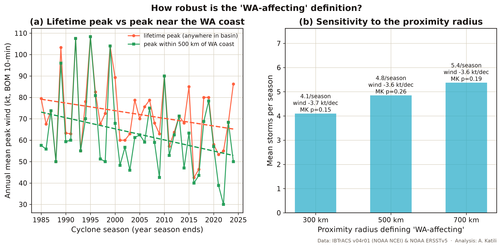

# Physical Climate Risk: Tropical Cyclone Trends Affecting Western Australia (1985–2024)

A data analysis written to support **AASB S2 physical-risk assessment**. AASB S2 is Australia's mandatory climate-disclosure standard (the rule that requires companies to report their climate risks).

> **The short version.** Between 1985 and 2024 the seas off Western Australia
> warmed by about 0.5 °C. That warming is solid and statistically significant (in
> plain terms, it is a real trend, not just luck of the draw). What the cyclones
> did over the same period is genuinely ambiguous, and that ambiguity is the
> finding. Whether the storms look like they weakened or strengthened depends on
> which agency's wind record you use: Australia's BOM 10-minute winds drift down,
> the US 1-minute winds drift up, **for the very same storms**, and neither WA
> trend is statistically significant. Central pressure, which has no
> averaging-time ambiguity, leans weakly toward weaker WA storms and shows no
> basin-wide trend at all. And once the shared long-term trends are removed,
> there is **no year-to-year link** between how warm the regional sea was and how
> strong the cyclones got. The practical lesson for climate risk is simple: you
> cannot read WA's future cyclone danger off the recent local record **in either
> direction**. Physical-risk assessment has to rely on forward-looking climate
> projections. That is exactly the kind of judgement AASB S2 asks companies to
> make.

An earlier version of this analysis led with "the storms drifted weaker." Then a
closer audit showed the opposite sign appears when the same test is run on the US
wind record, which covers far more of the basin. Rather than pick the convenient
metric, this version shows both, side by side, and lets the disagreement carry
the real message: 40 years of best-track data cannot settle the direction, so
risk assessment should not pretend it can.

---

## Research question

Have the tropical cyclones that affect Western Australia changed in strength
between 1985 and 2024, and does their strength rise and fall with warming sea
temperatures?

"WA-affecting" means a storm whose track passed within 500 km of the WA coast,
anywhere from the north Kimberley down to the Mid West. The study starts in 1985
because satellite coverage before then was too patchy to estimate storm strength
reliably.

## Data

| Source | What it provides | Used for |
|--------|------------------|----------|
| **IBTrACS v04r01** (NOAA NCEI) | Global best-track cyclone positions, winds and pressures | Cyclone counts, intensity, tracks |
| **BOM Tropical Cyclone Database** (IDCKMSTM0S) | Australia's official Southern-Hemisphere track record | Independent cross-check |
| **NOAA ERSSTv5** | Monthly 2° sea-surface temperature, 1854–present | SST trend and correlation |

A quick gloss on the jargon. Best-track data is the official storm-path record
that weather agencies keep for each cyclone. IBTrACS is the worldwide collection
of those records. ERSSTv5 is NOAA's long-running monthly record of sea-surface
temperature (the temperature of the top layer of the ocean, often shortened to
SST).

The analysis covers **758 South Indian Ocean systems**, of which **194 affected
WA**. Storm strength is reported in two ways: as the **BOM 10-minute sustained
wind** (the standard Australia uses, the wind speed averaged over 10 minutes) and
as **minimum central pressure** (the lowest air pressure at the storm's centre,
where lower means stronger).

A note on how wind is measured, because honesty matters here. Different agencies
average wind speed over different lengths of time. The US agencies report a
1-minute average; the Bureau of Meteorology (Australia's national weather agency,
shortened to BOM) reports a 10-minute average, which works out about 12% lower for
the very same storm. The two records also differ in coverage: BOM winds exist
only for storms in the Australian region (about 41% of the basin's storms, a
share that rises over the decades), while the US record covers about 90% of the
basin throughout. This analysis reports **both** wind records side by side,
because, as the findings below show, they disagree on the direction of the
trend, and it uses central pressure (which has no averaging-time ambiguity) as
the tie-breaker.

## How the data were validated

Before computing any trend, the cleaned data was checked for trustworthiness.

The BOM 10-minute winds in IBTrACS match the Bureau's own published database to
the knot for the major WA cyclones (Vance 1999 at 120 kt, Orson 1989 at 130 kt,
Marcus 2018 at 135 kt). The US 1-minute winds sit about 12% higher, exactly as
the difference in averaging period predicts. And 97% of the named WA-affecting
storms picked up by the 500 km rule also show up in the Bureau's Australian-region
database, which confirms the geographic filter is sound. Within the WA group, the
BOM wind data is 92% complete (85% in the 1980s, rising to 100% in the most recent
decade). So the headline measure is well-supported for the storms that matter
here, even though it is patchier across the wider basin, where other agencies are
in charge.

---

## Key findings

### 1. Frequency: stable, maybe drifting down a little

WA sees about 5 cyclones come within 500 km of the coast in an average season.
That number is broadly steady, with a slight downward drift, from about 5.1 per
season in 1985–2004 to 4.6 per season in 2005–2024. This fits the wider research
showing a long-term decline in the number of tropical cyclones in the Australian
region.


### 2. Intensity: the answer depends on which wind record you trust

This is the analytical heart of the project, and it is not the tidy story an
earlier draft told. On the BOM 10-minute record, the average peak strength of
WA-affecting cyclones drifts **down** across the four decades, and mean central
pressure rises (that is, weakens) from 959 hPa to 973 hPa. On the US 1-minute
record, **the very same storms drift up**.

| Decade | WA storms | Mean peak wind (BOM, kt) | Mean peak wind (USA, kt) | Mean min pressure (hPa) | Reached Cat 3+ |
|--------|:---------:|:------------------------:|:------------------------:|:-----------------------:|:--------------:|
| 1985–94 | 47 | 76 | 65 | 959 | 17% |
| 1995–04 | 55 | 78 | 80 | 955 | 38% |
| 2005–14 | 50 | 69 | 77 | 964 | 28% |
| 2015–24 | 42 | 63 | 75 | 973 | 19% |

*(Cat 3+ uses the Saffir–Simpson category, the familiar 1-to-5 hurricane scale,
which is defined on 1-minute winds. So it is computed from the US winds rather
than the 10-minute BOM value.)*


The formal trend tests make the disagreement explicit. Coverage means the share
of storms in the group that have that measurement at all:

| Series | Coverage | Trend | OLS p | Mann-Kendall p |
|--------|:--------:|-------|:-----:|:--------------:|
| WA peak wind, BOM 10-min | 92% | −3.6 kt/decade | 0.11 | 0.26 |
| WA peak wind, USA 1-min | 91% | +3.9 kt/decade | 0.07 | 0.16 |
| WA min pressure (BOM) | 92% | +4.0 hPa/decade (weakening) | 0.04 | 0.10 |
| Basin peak wind, BOM 10-min | **41%** | −3.7 kt/decade | 0.03 | 0.048 |
| Basin peak wind, USA 1-min | 90% | +3.7 kt/decade | 0.002 | 0.003 |
| Basin min pressure (WMO) | 89% | +0.7 hPa/decade | 0.45 | 0.62 |

Two of the test names above are worth a one-line gloss. The Mann-Kendall test is a
standard check for whether a trend is real or just chance. OLS (ordinary least
squares) is the usual way of fitting a straight-line trend through data. Every
p-value was also re-run with trend-free prewhitening (a standard correction for
year-to-year carry-over in a series); no series had enough autocorrelation to
change any of the numbers above.

How to read this honestly:

- **The two basin-wide wind trends are both "statistically significant" and they
  point in opposite directions.** The BOM series covers only 41% of basin storms
  (BOM is the agency for the Australian region only) and that share rises over
  time, so its "decline" partly reflects a changing mix of storms rather than
  physics. The US series has stable 90% coverage, but 1-minute winds have their
  own known artefact: satellite intensity estimation improved over the period,
  which tends to raise recent estimates. Neither series is clean enough to
  settle the direction, and the published literature carries the same
  disagreement for this basin.
- **Within the WA group, neither wind trend is significant**, and the small
  early-decade gaps in BOM winds (85% coverage in the 1980s, missing storms most
  likely the weaker ones) would bias the early means high, flattering a decline.
- **Pressure is the cleanest single measure** because every agency measures the
  same thing. It leans weakly toward weaker WA storms (borderline significance)
  and shows no basin-wide trend at all.

The defensible conclusion is not "storms got weaker." It is: **the observed
record does not establish an intensity trend for WA in either direction.**


### 3. Rapid intensification: appears to be rising, but read it with care

The share of storms that rapidly intensified (a wind jump of at least 30 kt in 24
hours, measured on the US 1-minute winds) rose from about 21% in 1985–1994 to
around 40% in the later decades. This is the one result that points toward a more
dangerous future, and it lines up with the physical expectation that warmer oceans
raise the ceiling on how fast a storm can strengthen.

It comes with a big caveat. Older best-track records are smoother and sampled less
often than modern ones, which automatically makes rapid intensification harder to
spot in the early years. So part of the apparent increase is probably an artefact
of better observations rather than a purely physical change. Treat the trend as
suggestive, not proven.


### 4. Sea-surface temperature: warming, but unhooked from intensity

The ocean in the WA cyclone development region warmed by **0.16 °C per decade**
(p < 0.0001, in other words a very strong result), about half a degree of warming
from the 1980s to today. Despite that, warmer seasons were **not** linked to
stronger WA cyclones. The raw correlation between seasonal SST and mean cyclone
wind is slightly negative (r = −0.22, p = 0.17), but a raw correlation between
two trending series partly measures the trends, not the year-to-year link. Once
both series are detrended (the shared long-term drift removed, leaving only the
year-to-year wobble), the correlation essentially vanishes: **r = −0.08,
p = 0.63**. The pressure version tells the same story (raw r = +0.30, p = 0.06;
detrended r = +0.14, p = 0.39). Warm seasons simply did not come with stronger
storms.


Sea-surface temperature sets the energy available to a cyclone, but it is not
the only thing that matters. Vertical wind shear (winds that change with height
and can tear a storm apart), mid-level moisture, and the large-scale circulation
(including ENSO, the El Niño/La Niña cycle, and the Indian Ocean Dipole, a
related Indian Ocean temperature pattern) all decide whether that energy
actually gets used. Over the WA record, those circulation factors appear to have
masked or outweighed the warming signal.

### 5. Robustness checks on the "WA-affecting" definition

Two checks make sure the results are not an artefact of how "WA-affecting" was
defined.

**Peak near the coast, not just anywhere.** The headline intensity metric is a
storm's lifetime peak, which can happen thousands of kilometres from WA. Risk to
WA assets depends on how strong storms are **near the coast**, so the trend was
re-run on each storm's peak wind within 500 km of the WA coastline. The
near-coast peak drifts down slightly faster than the lifetime peak (−5.2 vs
−3.6 kt/decade on BOM winds) but is still not significant at the 5% level
(Mann-Kendall p = 0.09). Same conclusion: no established trend.

**The 500 km radius itself.** Rerunning the whole pipeline with 300 km and
700 km radii changes the storm counts (4.1 and 5.4 per season, versus 4.9 at
500 km) but not the conclusions: the BOM wind trend stays near −3.6 kt/decade
and stays non-significant at every radius, and the frequency drift stays small
and non-significant.



---

## What this means for WA industry and AASB S2

Western Australia's coast carries the Pilbara iron-ore and LNG export
infrastructure, offshore oil and gas, coastal towns and farming, all of it exposed
to cyclones. Under AASB S2, the listed companies and large financial institutions
behind that infrastructure now have to disclose the climate risks that are
material to them. Reporting is being phased in from 1 January 2025, with the
larger second group, which captures many of the big WA operators, starting for
periods from 1 July 2026.

This analysis carries one clear, slightly uncomfortable message for that
disclosure work. The recent observed record supports **neither** a simple
"cyclones are getting stronger because the ocean is warming" story **nor** a
comforting "cyclones are getting weaker" story for WA. The trend's very sign
depends on which agency's wind record is used, neither WA wind trend is
statistically significant, and the cleanest measure (pressure) is borderline at
best. An honest physical-risk assessment cannot lean on the historical trend in
either direction. What it can and should do is recognise that the absence of an
established trend is not the same as safety. The ocean has warmed a lot, the
energy ceiling for the strongest storms has risen, rapid intensification may be
becoming more common, and forward-looking climate models still project a shift
toward fewer but potentially more intense systems. Good disclosure therefore
rests on scenario-based projections rather than simply extending the past in a
straight line, in any direction. That is precisely the discipline AASB S2 is
designed to enforce.

The timing is hard to miss. The 2025–26 season produced Severe Tropical Cyclone
Narelle, a Category 5 system that struck the Kimberley and Gascoyne in March 2026
with damage estimated near half a billion dollars. A quiet long-term trend and a
devastating individual season are not a contradiction. They are exactly why risk
has to be judged on the worst cases (the tail of the distribution), not the
average.

---

## Limitations

The honest caveats, stated plainly. The WA-affecting group is small, about five
storms a year, so WA-only trends have limited statistical power, and the
not-significant results should be read as "no clear signal" rather than "no
change." The two agency wind records disagree on the trend's direction, and
neither is free of artefacts: the BOM series covers a changing subset of basin
storms, and the US series carries the effect of improving satellite intensity
estimation; this analysis shows both rather than choosing one. Intensity
estimates rest on best-track data whose quality and sampling improved over the
period, which can bias trends, most sharply for rapid intensification (whose
21-27 hour detection window is also slightly liberal against the strict 24-hour
definition, equally in every decade). Trend p-values were checked with
trend-free prewhitening for serial correlation, which changed nothing here, but
the many tests run across series still mean borderline p-values near 0.05
deserve extra scepticism. The SST analysis uses a single regional box and a
seasonal average, so it captures the broad warming signal but not finer-scale
ocean structure. And 40 years is short for detecting climate trends. These
results describe what was observed in the satellite era, not a forecast of the
future.

## Reproduce it

Everything except the large raw files is in the repository. The cleaned datasets
are committed, so the notebook runs end to end without the multi-gigabyte
originals; place those in `data/raw/` to rebuild from scratch.

```
pip install -r requirements.txt
python test_stats.py          # validate the statistics against textbook values
jupyter lab cyclone_analysis.ipynb
```

Raw inputs (free): IBTrACS SI v04r01 and NOAA ERSSTv5 from NOAA NCEI, and the BOM
Southern-Hemisphere database from the Bureau of Meteorology. Exact sources are
listed in the notebook.

```
cyclone-risk/
├── cyclone_analysis.ipynb     # the narrated analysis, top to bottom
├── stats_utils.py             # OLS, Pearson, Mann-Kendall (+ prewhitened), Sen, Pettitt
├── test_stats.py              # validation against known values
├── build_dataset.py           # IBTrACS cleaning + WA-proximity flag
├── viz.py                     # chart styling
├── data/                      # cleaned, committed CSVs (raw/ is git-ignored)
└── charts/                    # seven publication-quality figures
```

## A note on the statistics

The trend and correlation tests are written from scratch in `stats_utils.py`
rather than pulled from a library, and `test_stats.py` checks them against known
textbook values. For example, the regression reproduces the Anscombe-quartet slope
and its p-value of 0.0022, and the Mann-Kendall matches a hand-computed series
that only ever moves one direction. (Pearson is the standard measure of how
closely two things move together, and Sen's slope is a robust way to estimate the
size of a trend.) The module also includes a Mann-Kendall variant with trend-free
prewhitening (Yue et al. 2002), which corrects the test when a series carries
year-to-year memory, and the Pettitt change-point test used by the rainfall
project. The same file is shared byte for byte with `rainfall-decline/` and CI
checks the two copies stay identical. This keeps the project light on
dependencies and fully transparent: every number can be traced to code you can
read.

---

### References and context

- **IBTrACS v04r01** (International Best Track Archive for Climate Stewardship), Knapp et al., NOAA NCEI. The global best-track cyclone dataset.
- **NOAA ERSSTv5** (Extended Reconstructed Sea Surface Temperature), Huang et al. (2017). The sea-surface temperature record.
- **AASB S2** *Climate-related Disclosures* (Australian Accounting Standards Board, 2024; phased commencement from 1 January 2025).
- **IPCC AR6 WG1** (2021), Chapter 11, *Weather and Climate Extreme Events in a Changing Climate*. Observed and projected tropical-cyclone trends.
- **Bureau of Meteorology and CSIRO**, *State of the Climate* (2024).
- **Kuleshov et al.**, *Trends in tropical cyclones in the South Indian Ocean and the South Pacific Ocean* (Journal of Geophysical Research, 2010). The observed decline in Australian-region tropical-cyclone frequency.
- **Bhatia et al.**, *Recent increases in tropical cyclone intensification rates* (Nature Communications 10:635, 2019). Rapid-intensification trends.
- **Kossin et al.**, *Global increase in major tropical cyclone exceedance probability over the past four decades* (PNAS 117:11975, 2020). The upward global intensity signal in the homogenised satellite record, which is why this analysis refuses to lean on a single agency's wind series.
- **Yue et al.**, *The influence of autocorrelation on the ability to detect trend in hydrological series* (Hydrological Processes 16:1807, 2002). The trend-free prewhitening correction used for every Mann-Kendall p-value here.

*Analysis by Adhi Muhammad Faris Katili. Data: IBTrACS (NOAA NCEI), BOM, NOAA
ERSSTv5. Part of the [adhi-climate](../) portfolio.*
