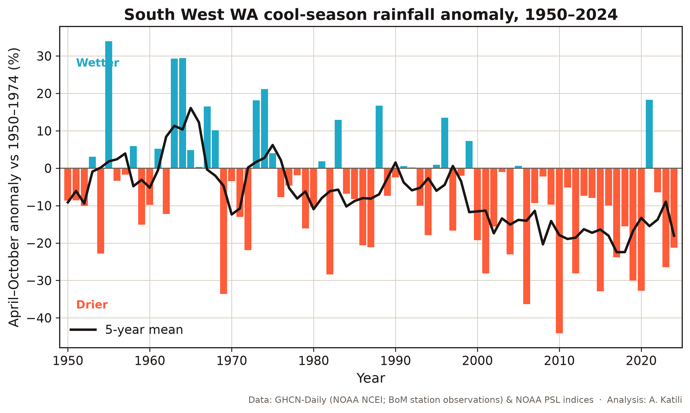
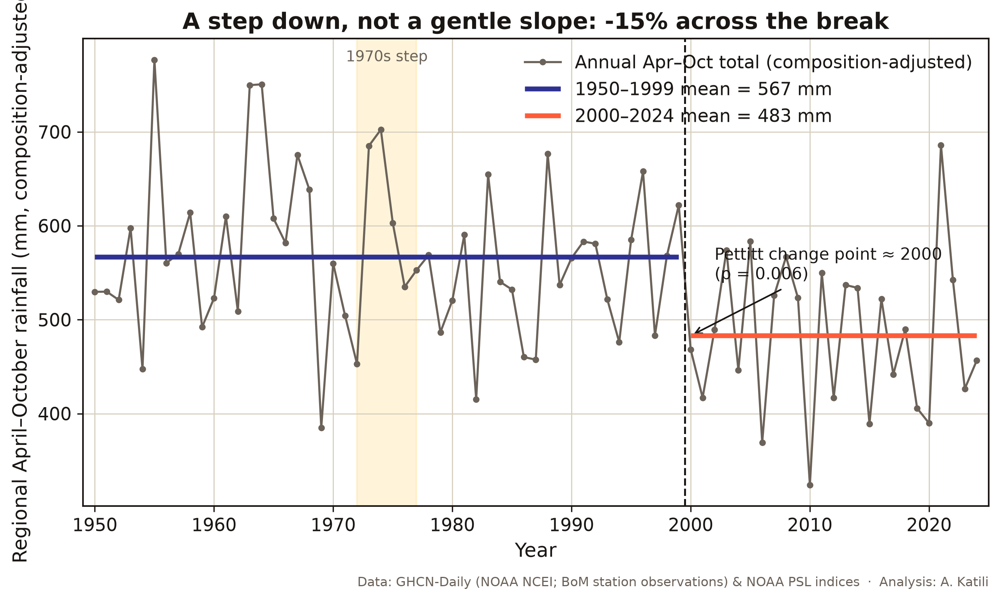
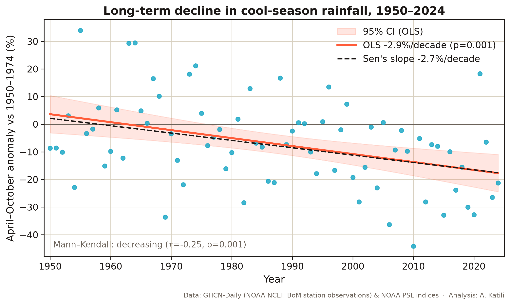
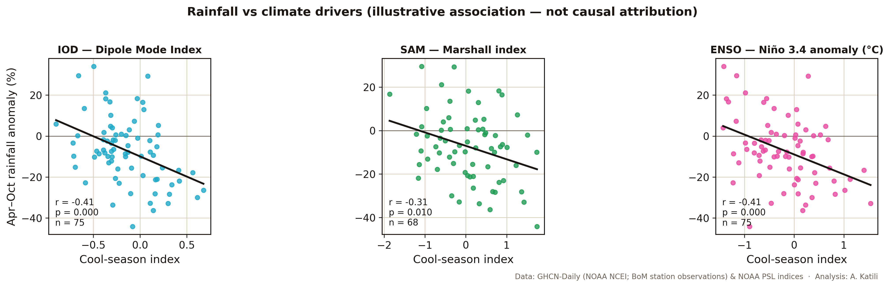
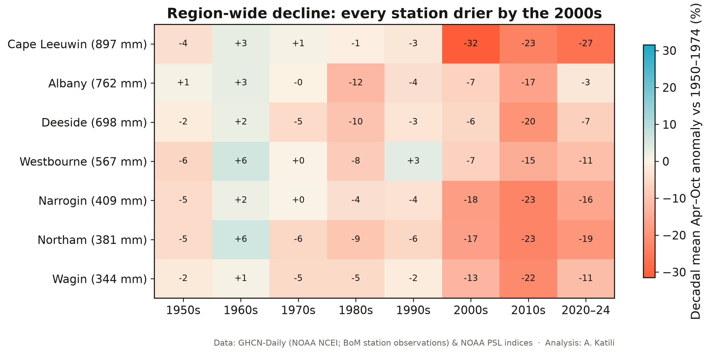

# Chronic Physical Climate Risk: South West WA Rainfall Decline (1950–2024)

A data analysis written for **AASB S2 physical-risk assessment** (AASB S2 is
Australia's mandatory climate-disclosure standard, the rulebook that says companies
must report their climate risks).

> **In one paragraph.** Winter rainfall in South West Western Australia has been
> falling. Across the cool season (April–October, the cooler months of the year)
> the drop is about **2.9% per decade since 1950**, and that drop is real, not just
> chance (Mann-Kendall p = 0.001; Mann-Kendall is a standard test for whether a
> trend is genuine). It did not fall as a gentle slope. It dropped as a **step down
> around the year 2000** (a sudden, lasting drop to a lower level), confirmed by the
> Pettitt change-point test (a standard check for the point where a series shifts to
> a new level), with p = 0.006. The regional total fell from about 567 mm in
> 1950–1999 to about 483 mm in 2000–2024 (figures adjusted so that years missing
> one of the wetter stations do not read spuriously dry), which leaves the last 25
> years roughly **17% drier** than the 1950–1974 baseline (the early reference
> period). The early
> winter peak (May–July) is falling even faster, about **4.4%/decade**, and the same
> pattern shows up at **all seven weather stations** studied. The decline itself is
> well established and matches the figures from CSIRO and the Bureau of Meteorology.
> What still carries some scientific debate is the *cause*, which is put down mainly
> to a strengthening band of high pressure over the subtropics and winter storm
> tracks shifting toward the South Pole, driven by greenhouse gases and ozone loss.
> For a water utility, a grain lender or an insurer this is a textbook case of
> **chronic** physical risk: a permanent move to a drier normal, not just a run of
> bad years.

---

## Research question

Has cool-season rainfall in South West WA fallen significantly since the middle of
the last century? How big is the change, how lasting is it, and how does it relate
to the main climate drivers?

The **cool season** is April–October, the Bureau of Meteorology's standard wet
season for the southwest. **May–July** is looked at on its own as the early-winter
stretch where the decline is known to be sharpest. Rainfall is measured against a
**1950–1974 baseline** (the reference period before the step-change happened).

## Data

| Source | What it provides | Used for |
|--------|------------------|----------|
| **GHCN-Daily** (NOAA NCEI) | Daily station rainfall; the Australian (`ASN*`) records are the **Bureau of Meteorology's observations** redistributed by NOAA in a script-friendly format | Seven SW WA station series, 1950–2024 |
| **NOAA PSL: DMI** | Dipole Mode Index | Indian Ocean Dipole (IOD) driver |
| **Marshall (2003) SAM index** (BAS) | Station-based Southern Annular Mode index, 1957– | SAM driver |
| **NOAA PSL: Niño 3.4 anomaly** | ERSST-based ENSO index | ENSO driver |

**Why use GHCN-Daily instead of the BoM website?** It is the same underlying station
data, but you can download it with a script. That means the whole analysis can be
re-run from start to finish without anyone clicking through web pages by hand.
The results are checked against BoM and CSIRO's published figures (see *Validation*).

**The seven stations** were picked because they have genuine, near-complete daily
records across 1950–2024 (at least 22 of the 25 baseline years and at least 22
recent years), and because together they cover the full range from wet to dry:

| Station | Setting | 1950–74 Apr–Oct baseline |
|---|---|---|
| Cape Leeuwin | Far SW tip, coastal (wettest) | 897 mm |
| Albany | South coast | 762 mm |
| Deeside | SW forest, high-rainfall zone | 698 mm |
| Westbourne | SW forest (Manjimup region) | 567 mm |
| Narrogin | Central wheatbelt | 409 mm |
| Northam | Northern Avon valley wheatbelt | 381 mm |
| Wagin | Southern wheatbelt | 344 mm |

> **Note on the Perth catchment.** The Perth Darling-scarp dam catchments
> (Mundaring, Jarrahdale) are the most-talked-about part of the SW WA water story,
> but their *daily* records in GHCN-Daily had too many gaps, so they were left out
> to avoid skewing the series. The high-rainfall stations in the SW corner pick up
> the same underlying signal.

## Method

1. **Clean** each station's daily rainfall, dropping any day that fails NOAA's
   quality checks. A month is kept only if it has 3 or fewer missing or failed days,
   and a cool season is kept only if all seven of its months are complete.
2. **Anomalies** (how far each year sits above or below normal) are worked out for
   each station against its *own* 1950–1974 average, in both mm and %. The
   **regional series** is the average of the per-station % anomalies (a year counts
   only if at least 5 of the 7 stations have data), so the wet coastal sites do not
   drown out the dry inland ones. Headline **mm** figures are
   **composition-adjusted**: the full-network baseline is rescaled by the % anomaly
   series, because a raw mm average of whichever 5-7 stations reported that year
   reads spuriously dry whenever a wet station (Cape Leeuwin, 897 mm) is missing.
   The raw station-mix figures are reported alongside for comparison; the
   adjustment moves the pre/post drop from about 17% to about 15%.
3. **Step-change**: the **Pettitt** test, a non-parametric change-point test (it
   finds where a series jumps to a new level without assuming any particular shape).
4. **Trend**: the **Mann-Kendall** test for whether a trend is real (each p-value
   also re-run with trend-free prewhitening, a standard correction for
   year-to-year carry-over; it changed nothing here), plus **Sen's slope** (a
   robust way to size the trend that is not thrown off by odd years), plus **OLS**
   (ordinary least squares, the standard straight-line fit) with a 95% confidence
   band. These are run on the full record, on the record before and after the
   change point, on the May–July sub-season, and on each station.
5. **Drivers**: Pearson correlation (a standard measure of how closely two things
   move together) of the cool-season rainfall anomaly against the cool-season IOD,
   SAM and ENSO indices, reported both **raw and detrended**. Detrended means the
   shared long-term trend is taken out first, so what is left is the year-to-year
   wobble.

All the statistics, OLS, Pearson, Mann-Kendall (plain and prewhitened), Sen's
slope and the Pettitt test, are coded from scratch in
[`stats_utils.py`](stats_utils.py) and checked against known values in
[`test_stats.py`](test_stats.py) (28 checks). **scipy is not required.**

## Key findings

| Result | Number | Significant? |
|---|---|---|
| Apr–Oct trend, 1950–2024 | **−2.9%/decade** (≈ −20 mm/decade) | **Yes** (OLS p=0.0005; MK p=0.001, τ=−0.25) |
| May–July trend, 1950–2024 | **−4.4%/decade** | **Yes** (MK p=0.0001) |
| Step-change (Pettitt) | **~2000** | **Yes** (p=0.006) |
| Pre/post the break (composition-adjusted) | 567 mm (1950–99) → 483 mm (2000–24) = **−15%** | n/a |
| 1950–1974 vs 2000–2024 (composition-adjusted) | 583 mm → 483 mm = **−17%** | n/a |
| Trend *before* 2000 | flat (no slide toward the break) | No (MK p=0.71) |
| Trend *after* 2000 | flat (stepped to a drier normal) | No (MK p=0.66) |
| Stations declining | **7 of 7** (6 significant) | n/a |

The flat trend on **both** sides of the break is what justifies calling this a
step rather than a slope: the series does not drift down and then keep drifting;
it sits on one level, drops, and sits on a new one. (The raw station-mix mm
figures, without the composition adjustment, are 571 → 475 mm = −17%; the
adjustment matters by about two percentage points and is the honest version.)
| IOD (DMI) correlation | r = −0.41 raw / −0.26 detrended | raw p=0.0003; detrended p=0.027 |
| ENSO (Niño 3.4) correlation | r = −0.41 raw / −0.35 detrended | raw p=0.0003; detrended p=0.002 |
| SAM (Marshall) correlation | r = −0.31 raw / −0.20 detrended | raw p=0.010; detrended p=0.11 (n.s.) |







## Validation

The Bureau of Meteorology and CSIRO's *State of the Climate* report a **~16%
April–October** and **~20% May–July** decline for SW WA since 1970 (measured against
a 1900–1969 baseline), and they say a decline this large is "highly unlikely … due
to natural variability alone." This analysis uses different stations, a different
baseline period, and a completely separate set of code, yet it lands in the same
place: about 17% drier (1950–74 vs 2000–24), with May–July falling the fastest. That
agreement is the credibility check.

## What this means: AASB S2 chronic physical risk

- **Chronic, not acute.** A permanent downward shift in the baseline is exactly the
  kind of slow, persistent hazard AASB S2 asks companies to spot and report. Because
  it is a *step-change* (a sudden move to a new level), the pre-2000 climate is no
  longer a fair planning baseline. The recent 25 years are the new normal.
- **Who is exposed:** Perth's water supply (dam inflows have fallen much more than
  rainfall, because a modest drop in rain turns into a large loss of runoff); the
  wheatbelt grain economy and the banks that lend to it; and property and crop
  insurers having to reprice the southwest.
- **The decision it forces:** judge this risk against the post-step-change baseline
  and forward-looking projections, not against a long historical average that no
  longer describes today's climate.

## Attribution: what causes the decline (referenced, not invented)

The **decline is solid**; the **cause** is still being pinned down, and this analysis
does not try to do formal cause-and-effect attribution. Here is the published
picture:

- The most immediate cause is a **strengthening band of high pressure over the
  subtropics** and a **shift of the winter westerly winds and storm tracks toward
  the South Pole** (which goes with a more-positive Southern Annular Mode). Together
  these bring **fewer rain-bearing cold fronts** to the southwest.
- These changes in air circulation are largely **human-caused**: greenhouse gases
  plus the thinning of the ozone layer in the stratosphere. Detailed models only
  reproduce the decline when that human influence is included.
- **The exact split varies by study and method**: one modelling estimate finds about
  43% of the multi-decade decline is driven by outside forcing; other work pins up to
  two-thirds of the post-1975 decline on the strengthening high-pressure ridge;
  climate change is commonly linked to a 20–30% drop in rainfall. The decline is
  certain; the precise breakdown is not.
- The **Indian Ocean Dipole** (more frequent positive events) and **ENSO** add the
  year-to-year ups and downs.

**This project's own correlation is illustrative, not proof of cause.** IOD, ENSO and
SAM are all negatively linked with cool-season rainfall (r ≈ −0.3 to −0.4), but once
the shared long-term trend is removed, the year-to-year links are modest. In plain
terms: the climate modes explain the year-to-year *wiggles*, while the forced change
in air circulation explains the downward *staircase*. The correlation here fits the
published literature but does not prove cause.

## Limitations

- Seven stations, not a full gridded regional product. The result is solid and
  spatially consistent, but it is not a substitute for BoM's gridded analysis.
- **The station records are not homogenised.** GHCN-Daily redistributes the raw
  gauge observations; station moves and instrument changes can create artificial
  steps in a single record, which is exactly what a change-point test detects.
  Averaging seven independent stations dilutes any one station's artefact, and
  the agreement with CSIRO/BoM's published (quality-controlled) figures is the
  practical check, but a fully homogenised comparison (for example against BoM's
  gridded AGCD product) would close this gap properly.
- The Perth Darling-scarp catchment is not directly included (its daily data was too
  gappy).
- The Pettitt test reports a single main change point (~2000). The smaller mid-1970s
  step that the literature describes is visible in the series but is not tested
  separately here. The test also assumes independent observations; the series'
  lag-1 autocorrelation is small (r1 ≈ −0.09), so this is unlikely to matter here,
  but a Pettitt p-value on an autocorrelated series should generally be read with
  care.
- The driver correlation shows association, not formal attribution.

## Reproduce

```bash
pip install -r requirements.txt

# 1. statistics are correct
python3 test_stats.py

# 2. rebuild the clean CSVs from raw downloads (see data/raw/ note below)
python3 build_dataset.py

# 3. run the analysis (prints the findings, writes summary CSVs)
python3 analysis.py

# 4. regenerate the charts
python3 viz.py
```

Raw downloads live in `data/raw/` and are **git-ignored** (you can re-download them
from the sources listed above): the GHCN-Daily station files `ASN000095xx/0101xx.dly`,
the GHCN metadata `ghcnd-stations.txt` and `ghcnd-inventory.txt`, and the three index
files `dmi.had.long.data`, `marshall.sam.txt`, `nina34.anom.data`. The cleaned CSVs in
`data/` are committed, so the analysis and charts can be reproduced without
re-downloading anything.

## Repo structure

```
rainfall-decline/
├── README.md                 ├── analysis.py        (step-change, trend, drivers)
├── requirements.txt          ├── viz.py             (5 charts)
├── rainfall_analysis.ipynb   ├── stats_utils.py     (MK, Sen, OLS, Pearson, Pettitt)
├── cv-blurb.txt              ├── test_stats.py      (28 unit tests)
├── INTERVIEW_BRIEF.md        ├── build_dataset.py   (parse + clean)
├── data/   (committed CSVs; raw/ git-ignored)
└── charts/ (5 × 300 dpi PNG)
```

## Sources

- CSIRO & Bureau of Meteorology, *State of the Climate 2024*: https://www.csiro.au/en/research/environmental-impacts/climate-change/state-of-the-climate/report-at-a-glance
- BoM, *Recent rainfall, drought and southern Australia's long-term rainfall decline*: https://www.bom.gov.au/climate/updates/articles/a010-southern-rainfall-decline.shtml
- Delworth & Zeng (2014), *Regional rainfall decline in Australia attributed to anthropogenic greenhouse gases and ozone levels*, Nature Geoscience: https://www.nature.com/articles/ngeo2201
- Hawke et al. (2025), *A Review of Drivers of Cool Season Rainfall in Southwest Western Australia*, WIREs Climate Change: https://wires.onlinelibrary.wiley.com/doi/10.1002/wcc.70028
- Data: GHCN-Daily (NOAA NCEI); NOAA PSL climate indices; Marshall (2003) SAM index (BAS).

---

*Author: Adhi Muhammad Faris Katili · Master of Environment and Climate Emergency,
Curtin University. Statistics implemented from first principles and unit-tested;
findings independently validated against CSIRO/BoM published figures.*
